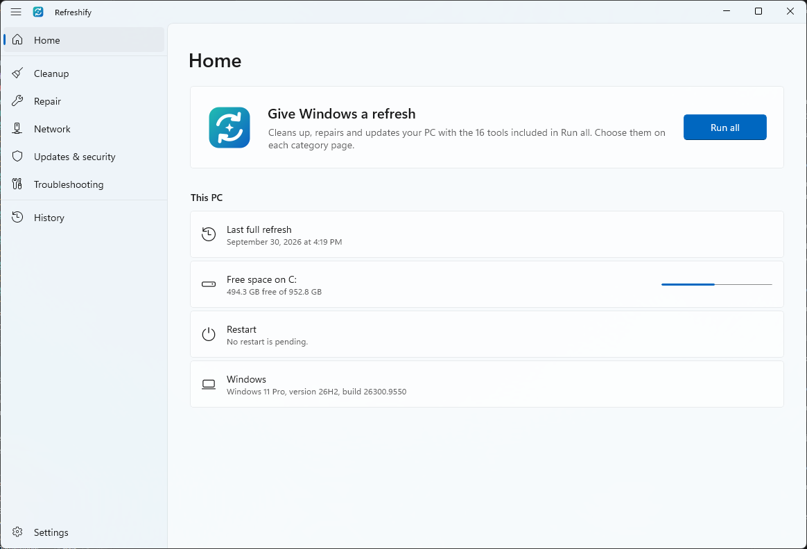
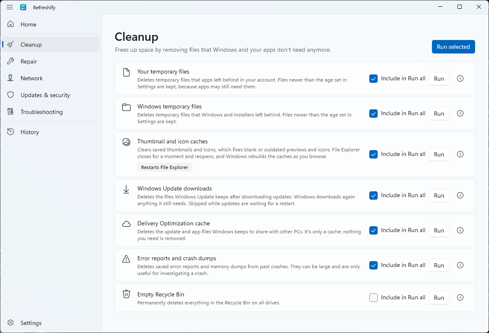
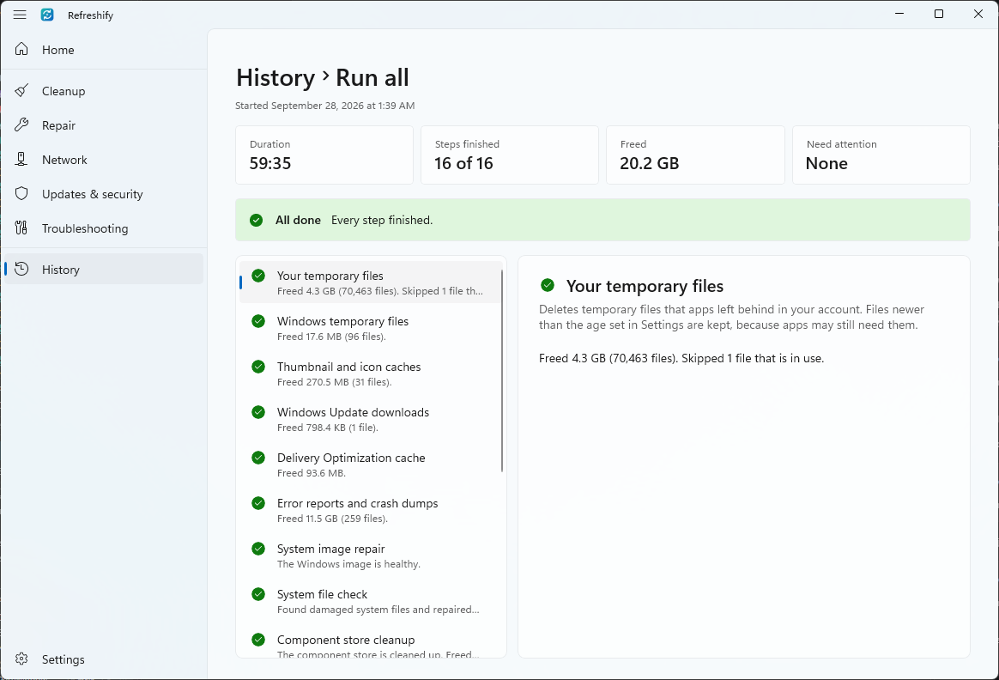

<p align="center">
  
</p>

<h1 align="center">Refreshify</h1>

<p align="center">
  Give Windows a refresh. Refreshify cleans up, repairs and updates your PC with the tools Windows already has, in one
  native Windows 11 app, without a single terminal window.
</p>

<p align="center">
  <a href="https://github.com/lukastojiljkovic/Refreshify/actions/workflows/ci.yml"></a>
  <a href="https://github.com/lukastojiljkovic/Refreshify/releases/latest"></a>
  <a href="LICENSE"></a>
</p>

<picture>
  <source media="(prefers-color-scheme: dark)" srcset="docs/images/home-dark.png">
  
</picture>

## Download

Download `Refreshify-<version>-Setup.exe` from the [latest release](https://github.com/lukastojiljkovic/Refreshify/releases/latest).

- **Requirements:** Windows 11, or Windows 10 version 1809 or later, x64. Nothing else to install.
- **Administrator approval.** Setup installs to Program Files. Refreshify starts its own exe as administrator for the
  tools that need it, so it must live where only administrators can replace it.
- **SmartScreen.** The installer isn't code-signed yet, so Windows may warn you. Check that the file's SHA-256 matches
  the one in the release notes (`Get-FileHash .\Refreshify-<version>-Setup.exe`), then select **More info** >
  **Run anyway**.

## Features

- **Run all** runs the tools you choose, in an order that avoids known failures. Or run a category, or a single tool.
- **Plain language.** Every tool says what it does, and troubleshooting tools say when to use them. You see what each
  step is doing, how long it takes and what it found, never a terminal.
- **Safe by default.** Refreshify lists what a run will do before it starts, and creates a System Restore point first.
- **Known problems, fixed.** Refreshify recognizes 15 common failures, explains them and fixes the ones it safely can,
  such as a damaged Windows Update cache or a disabled repair service. It asks first before fixes that change more.
- **Health** looks at your PC and says how it is doing, in plain words: free space on each drive, the health your
  drives report, battery wear, whether a restart is waiting, how long since the last restart, virus protection, the
  last Windows update and whether Windows is activated. Each check says what it found and what to do, and where
  Refreshify has a tool for it, a button opens that tool. Home shows a line when something needs attention. Nothing is
  changed, and it needs no administrator approval.
- **Disk space** scans your files or a drive and lists the folders and files that take the most space, largest first,
  each with its size and its share of the folder. Select a folder to go into it, or switch to **Largest files** to see
  the 100 largest files below where you are. Every row opens its place in File Explorer, and nothing is deleted from
  this page.
- **Get help** turns a failed step into a report to paste into an AI assistant such as Copilot, ChatGPT or Claude, with
  your user name, computer name and profile folder hidden by default.
- **History** keeps the results of the last 50 runs, with how long they took and the space they freed, and **technical
  details** show each command and its output.
- **Readable updates.** Refreshify checks GitHub for a newer release when it starts, at most once a day, and shows what
  changed in plain words before you update. It verifies the installer against the SHA-256 checksum published with the
  release, installs it, and then shows what changed in the new version. The automatic check can be turned off.
- **A reminder**, if you want one, to refresh your PC every 1, 2, 3 or 6 months.

<picture>
  <source media="(prefers-color-scheme: dark)" srcset="docs/images/cleanup-dark.png">
  
</picture>

## Tools

Tools marked with ✓ are part of *Run all* unless you turn them off. Troubleshooting tools fix specific problems, so
you run them when you notice the problem they describe, or add them to *Run all*.

| Category | Tool | What it does | Run all |
| --- | --- | --- | :---: |
| Cleanup | Your temporary files | Deletes temporary files apps left in your account, keeping recent ones | ✓ |
| | Windows temporary files | Deletes temporary files Windows and installers left behind | ✓ |
| | Thumbnail and icon caches | Fixes blank or outdated previews and icons | ✓ |
| | Windows Update downloads | Deletes update files Windows already installed | ✓ |
| | Delivery Optimization cache | Deletes update files Windows keeps to share with other PCs | ✓ |
| | Error reports and crash dumps | Deletes reports and memory dumps from past crashes | ✓ |
| | Empty Recycle Bin | Permanently deletes everything in the Recycle Bin | |
| Repair | System image repair | Repairs the component store Windows repairs itself from (`DISM /RestoreHealth`) | ✓ |
| | System file check | Replaces damaged Windows files (`sfc /scannow`) | ✓ |
| | Component store cleanup | Removes Windows components that updates replaced | ✓ |
| | Disk check | Scans the system drive for file system errors (`chkdsk /scan`) | ✓ |
| Network | Network caches | Clears the DNS and ARP caches | ✓ |
| | Time sync | Syncs the clock, which secure websites and updates depend on | ✓ |
| Updates & security | Defender definitions | Updates Microsoft Defender Antivirus | ✓ |
| | Windows Update | Installs available Windows updates | ✓ |
| | App updates | Updates your apps with winget | ✓ |
| | Defender quick scan | Scans for malware with Microsoft Defender Antivirus | ✓ |
| Troubleshooting | Renew IP address | Gets a new address from your router | |
| | Network stack reset | Resets Windows' network settings | |
| | Reset Windows Update | Gives Windows Update a new cache | |
| | Microsoft Store cache | Fixes a Store that won't open or download | |
| | Font cache | Fixes text in the wrong font | |
| | Print queue | Clears stuck print jobs | |
| | Search index | Rebuilds the Windows Search index | |
| | Audio services | Restarts the Windows audio services | |
| | Start menu and taskbar | Restarts File Explorer, Start and search | |
| | Graphics shader cache | Fixes game stutter and glitches after a driver update | |

## How it works

- **Hidden processes.** Refreshify runs Windows' own tools (DISM, SFC, chkdsk, winget, PowerShell cmdlets and the
  Windows Update Agent API) without windows, reads their progress and results, and shows them in the app. Cleanups run
  in Refreshify itself, skip files that are in use and never follow junctions or symbolic links.
- **One approval per session.** Tools that need administrator rights run in an elevated helper, started the first time
  one runs, so Windows asks once. The helper runs only the tools in Refreshify's catalog and talks to the window over a
  named pipe that only the two of them can use.
- **A safe order.** *Run all* creates the restore point first, then runs Cleanup, Repair, Network, Updates & security
  and Troubleshooting. Cleanup comes first because DISM and Windows Update need free space, Repair comes before updates
  because a damaged component store makes them fail, and DISM always runs before SFC.
- **Language-independent detection.** Refreshify recognizes problems from exit codes, error codes, `CBS.log` and
  `DISM /English`, never from console text, so it works the same in every Windows language.
- **A read-only look.** **Health** reads the state of your PC as it is: free space, what your drives report, battery,
  restart state, virus protection, the last update and activation. It changes nothing, needs no administrator
  approval, and Home and **Health** share the same results until you check again. **Disk space** reads folder listings
  and file sizes; it doesn't follow junctions and symbolic links, and it deletes nothing.

<picture>
  <source media="(prefers-color-scheme: dark)" srcset="docs/images/run-dark.png">
  
</picture>

## Verification

- **Unit tests:** `dotnet test --project tests/Refreshify.Core.Tests` runs 338 tests. They cover the tool catalog, the
  parsers for DISM, SFC, chkdsk, winget and Windows Update results, known-problem detection, cleanups on real files
  (age filter, files in use, junctions), the run engine (order, fixes, retries, declined elevation and cancellation),
  the Get help report and its redaction, the elevated helper's protocol over a real named pipe, the release-notes
  parser, the **Health** checks and their wording, and the **Disk space** scan.
- **UI Automation** on Windows 11 Pro 25H2 (build 26200): every page, a real run of a tool that doesn't need
  administrator rights, the dialogs, the Get help report and its clipboard copy, settings that persist across restarts,
  light and dark themes, a second start that brings the first window to the front, the reminder task and notification,
  and the uninstaller's cleanup.
- **CI** checks formatting, runs the tests, builds the installer and installs and uninstalls it silently on every push.

### Verifying the administrator tools

These tools need your approval in a UAC prompt, which automation can't give, so they're checked by hand:

1. Install Refreshify, open **Settings** and turn on **Show technical details**.
2. On **Home**, select **Run all**, then **Run**, and approve the UAC prompt once.
3. Check that each step ends with a result, and that a step that needs attention explains why and offers a fix or
   **Get help**. **Technical details** show every command and what it printed.
4. Run each troubleshooting tool once from its **Run** button.
5. Run **Audio services** again and select **Stop** right away: the step still finishes, and sound works afterwards.
6. Open **History**: the run is listed with the same results.

## Limitations

- Refreshify can only fix what Windows' own tools can fix, and results depend on them and the services they use.
- System image repair downloads from Windows Update. On PCs whose updates are managed by an organization, it may need a
  Windows installation image (ISO) of the same version and language instead, which Refreshify lets you choose.
- Disk check scans while Windows runs. Problems that need exclusive access are repaired at the next restart, which
  Refreshify can schedule.
- Windows Update installs available updates; optional updates and updates that need your input are left for Settings.
- App updates only covers apps that winget knows, and apps that are open may not update until you close them.
- The Defender tools are skipped when another antivirus protects your PC.
- **Health** shows the state of your PC at the moment its checks run, and Home keeps showing the same results until
  they run again. Open **Health** and select **Check again** for a fresh look. A check that can't read what it needs,
  or takes too long, says **Couldn't check this right now** instead of guessing.
- **Disk space** counts the sizes it can read. Folders it can't read, such as protected system folders, are counted as
  unreadable and listed. Cloud files that are kept on this PC are counted at their full size; files that are only
  online take no space on this PC, so they aren't counted. Junctions and symbolic links aren't followed, and folders
  more than 512 levels deep are counted as unreadable. For a whole drive, the page also reports the space Windows says
  is used that the scan couldn't count, such as other users' files and system files.
- Refreshify is x64 only and in English. It has been tested on Windows 11 25H2; Windows 10 hasn't been tested.
- Uninstalling removes the settings, history and reminder of the account that runs the uninstaller.

## Building

You need the [.NET 10 SDK](https://dotnet.microsoft.com/download/dotnet/10.0), and
[Inno Setup 6](https://jrsoftware.org/isinfo.php) for the installer (`winget install JRSoftware.InnoSetup`).

```powershell
dotnet test --project tests/Refreshify.Core.Tests    # unit tests
dotnet run --project src/Refreshify -p:Platform=x64   # run the app
.\build.ps1                                           # tests, publish, licenses and artifacts\installer\Refreshify-<version>-Setup.exe
```

See [CONTRIBUTING.md](CONTRIBUTING.md) for the rules the code follows and how to add a tool.

## Project structure

```text
src/Refreshify.Core          All logic, no UI: the tool catalog, tools, process runner, parsers, run engine, known
                             problems, Get help report, Health checks, disk-space scan, release notes, elevated
                             helper protocol and history
src/Refreshify               WinUI 3 app; the same exe hosts the elevated helper (--worker) and the reminder (--reminder)
tests/Refreshify.Core.Tests  Unit tests (xUnit v3)
installer/Refreshify.iss     Inno Setup script
docs/ARCHITECTURE.md         Design and behaviour
```

## Legal

- [Terms of Use](TERMS.md), which Setup asks you to accept
- [Privacy Statement](PRIVACY.md): Refreshify doesn't collect or send personal data; the only request it makes itself is
  the update check against GitHub. **Health** and **Disk space** read your PC, and nothing they read leaves it
- [Third-Party Notices](THIRD-PARTY-NOTICES.md)
- [Security Policy](SECURITY.md)
- [Contributing](CONTRIBUTING.md): how to build, test and add a tool
- [Code of Conduct](CODE_OF_CONDUCT.md)
- [Support](SUPPORT.md): where to ask
- [Product](PRODUCT.md): what Refreshify is for and who it is for
- [Design](DESIGN.md): the visual design system

Windows is a trademark of the Microsoft group of companies. Refreshify isn't affiliated with or endorsed by Microsoft.

## License

[MIT](LICENSE) © 2026 Luka Stojiljkovic
